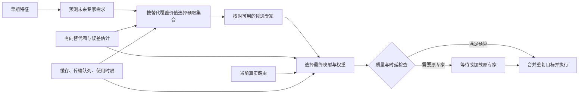

# MoE 专家替代算法与预取协同：六篇论文分析及研究设计

调研日期：2026-09-29。本文依据论文正文、公式、算法与附录独立整理；SMoE 的权重处理另核对了作者代码。文中的性能数据均为作者报告，本次未复现实验。第 1–4 节是文献分析，第 5–8 节是研究判断与待验证提案。

## 1. 核心结论与比较口径

**prefetch + expert substitution 已有直接先例。** BuddyMoE 在预取 miss 时选驻留 buddy；SMoE 联合设计高分专家预取、低分专家替代与缓存淘汰；CommitMoE 直接执行预测并预取的专家集合。扩展文献中，APEX 提供基于预取候选的近似执行模式，SPICE 使用共享专家与低秩残差处理部分 miss。[1][], [5][], [6][], [7][], [8][]

**更值得研究的是：让可替代性参与“提前搬谁”的决策，而不仅参与“缺谁以后怎么办”。** 可以将预测、按时到位、条件替代误差与最终执行集合联合建模，优化质量约束下的真实延迟。建议优先验证“面向替代覆盖的预取集合选择”，再增加“miss 条件下的联合输出误差估计”和“考虑剩余到位时间的执行决策”。这些是本文提出的研究方向，原创性仍需围绕具体算法继续检索和实验确认。

### 1.1 “减少激活专家”需要拆成四个量

对某层、某个 token，原生路由选出集合 $A(x)$，大小为 $K$，输出为：

$$
y(x)=\sum_{e\in A(x)}g_e(x)E_e(x).
$$

这里的 $g_e$ 已包含模型自身的归一化和 routed scaling；原生共享专家的贡献单独计算。替代关系均发生在同一 MoE 层内。

| 统计量 | 定义 | 与收益的关系 |
|---|---|---|
| 每 token 不同专家数 | $K_{\mathrm{uniq}}(x)=\lvert\{e:e\text{ 被该 token 实际使用}\}\rvert$ | 只有执行器复用相同 token、相同专家的输出时，才对应减少专家前向 |
| dispatch 槽位数 | 传给 MoE kernel 的 token-expert 路由条目数 | 多个槽位可能指向同一个专家，仍可能重复计算 |
| batch 专家并集 | $U=\lvert\bigcup_x A'(x)\rvert$ | 影响专家权重工作集、访存与调度；不同 token 的专家输出不能互相复用 |
| 加载量与等待 | 实际新增权重字节、到位时间、关键路径上的 stall | 驻留替代可降低这些量，即使每 token 仍执行 $K$ 个专家 |

例如，一个 token 原来执行 $a,b,c$，把 $c$ 改成缓存中的 $d$，仍执行三个不同专家，但可能少一次加载。把 $c$ 映射到已经执行的 $a$，再把两份权重相加，才可以只执行两个不同专家。对 batch 中另一个 token 已执行的 $a$，仍需计算本 token 的 $E_a(x)$。

这六篇论文主要讨论运行时的选择、重路由和输出校正；不能统一解释成永久删除专家参数后的模型压缩。ExFold 附录还提供固定 decode pool 变体，需要与其动态主路径分别理解。

### 1.2 六篇论文总览

| 工作 | 触发条件与替代候选 | 替代依据 | 权重/输出处理 | 主要减少的成本 |
|---|---|---|---|---|
| **BuddyMoE** | 被请求专家不在 GPU；从驻留 buddy 中选 | 离线共激活排名，加 token 熵和 residency gate | Alg. 1 改专家 ID；未给出新的权重校正式 | miss 加载和等待；实现保持 token 内候选唯一 |
| **ExFold** | 专家超出 token/batch 预算；映射到 retained set | 有方向的标量重构损失 | $g_eE_e\approx g_ec_{e\to b}E_b$；prefill 合并权重 | prefill 专家计算；decode batch 权重工作集 |
| **SERE** | batch 内 secondary expert；映射到 primary 并集 | 校准输出相似度及阈值 | 保持各路由槽位原权重，修改 ID | batch 内不同专家数和权重访存 |
| **LDA** | top-k 减少后，对聚合输出进行校正 | 每层、每个 k 的逐维均值和标准差 | 逐维仿射分布对齐 | 质量恢复；计算节省来自搭配的稀疏路由 |
| **SMoE** | 未驻留的低分原选专家；使用驻留/本 batch 必需的未选专家 | 当前 token 的 gate 分数接近 top-k 边界 | 作者实现使用新专家自身 gate 分数，再按模型配置归一化 | PCIe 加载、CPU 计算和等待；通常保持 K |
| **CommitMoE** | 直接采用提前预测、预取的 top-k | 预测路由分布；高确定性易预测、低确定性选择较鲁棒 | 可选 OWA：遗漏权重重分配与整体缩放 | 预测错误后的纠正加载；保持 K |

BuddyMoE、ExFold、SERE、LDA 的主方法不更新基模参数；其中前三者分别需要共激活、输出投影或相似度校准，LDA 需要矩统计。SMoE 的论文方案不需要离线校准；CommitMoE 需要训练辅助预测器，“基模无需重训”与“完全不训练任何模块”应分开。[1–6]

## 2. 逐篇算法分析

### 2.1 BuddyMoE：预取 miss 时使用驻留 buddy

**定位。** 原专家保留在 CPU，GPU 只缓存部分专家。BuddyMoE 位于真实 router 和专家执行之间，对 GPU 缺失的原选专家寻找替代，主要目标是缓解预取失败后的搬运等待。[1，§3–4、Alg. 1]

#### 离线：用共激活构建有方向的候选表

对每层收集原生 top-k 路由轨迹，记录专家共激活次数 $M(i,j)$。以被替代专家 $i$ 为中心，归一化得到：

$$
q_{j\mid i}=\frac{M(i,j)}{\sum_{j'\ne i}M(i,j')},\qquad q_{i\mid i}=0.
$$

按 $q_{j\mid i}$ 从高到低排序为 $\pi_i$，取累计频率达到 CFT 阈值 $\alpha$ 的最短前缀：

$$
t_i(\alpha)=\min\left\{t:\sum_{r=1}^{t}q_{\pi_i(r)\mid i}\ge\alpha\right\},\qquad
\mathcal B(i)=\{\pi_i(1),\ldots,\pi_i(t_i)\}.
$$

论文还描述了平滑、概率加权共激活、分层阈值与候选表长度上限。这里的主算法依据是**共激活统计**。摘要提到输出相似性，但 §3 的可复现公式没有给出类似 ExFold 的输出回归目标，因而不应把两者当成相同的相似度算法。

#### 在线：先判断替代是否允许，再检查驻留候选

1. **token 熵门控。** 使用原选 top-k 内归一化概率：

   $$
   H(x)=-\frac{\sum_{e\in A(x)}\tilde g_e(x)\log\tilde g_e(x)}{\log K}.
   $$

   §3.1 的规则为 $H(x)\le\tau$ 时禁止替代，否则允许。其直觉是路由越集中，token 对特定专家越敏感。这是经验启发式，不是功能误差保证。

2. **batch 驻留门控。** 令 $R$ 为当前 batch 的请求专家并集，$\delta=|R\cap\mathrm{CPU}|/|R|$。当 $\delta\ge\beta$ 时跳过替代，避免一次替换过多专家。

3. **候选选择。** 在 $\mathcal B(i)\cap\mathrm{GPU}$ 中，优先共激活频率高的候选；论文给出可选的当前 token logit 和拓扑惩罚，默认相关修正系数为 0。

4. **保持多样性。** §4 的 Alg. 1 在前 $H$ 个 buddy 中找 GPU 驻留且不属于当前 token 活跃集合的专家，因此该实现不会通过将多个路由合并到同一专家来减少 token 内不同专家数。找不到候选时，Alg. 1 保留原专家；系统讨论还列出加载或基线 drop policy 等分支。

#### 权重语义与解释边界

Alg. 1 的输入输出只涉及专家 ID、驻留掩码和 buddy 表，没有给出新权重估计。按“保留槽位权重、替换 ID”的实现解释，可写成：

$$
g_i(x)E_i(x)\longmapsto g_i(x)E_b(x).
$$

这是一种索引替换的表达，不是论文证明了 $E_i\approx cE_b$，也没有 ExFold 的标量补偿。复现时应明确权重约定。

**关键限制。** 高共激活可能源于互补分工，不必然表示输出相似。正文 §3 对重复候选是软惩罚，§4 算法则硬性排除重复；§3.1 的熵规则还意味着提高 $\tau$ 才更保守，与 §3.4 将“低 $\tau$”称作保守设置的描述不一致。复现应按具体公式和算法固定版本，而非混用文字概括。

**证据尺度。** Table 2 中一个设置的平均 ARC 分数从 0.735 变为 0.695，吞吐从 34.23 变为 36.75 token/s，即约 7.4% 提升并伴随 4 个百分点质量下降。评估新方法时应画质量–性能曲线，不能仅沿用摘要中的“negligible accuracy loss”。

**对 prefetch 的启发：** buddy 能兜底一部分 miss；进一步让 buddy 的覆盖价值影响预取和缓存，是可研究的扩展。

### 2.2 ExFold：以方向性标量投影回收被省略专家的贡献

**定位。** ExFold 将减少专家使用表述为输出近似：先确定保留集合，再把省略专家的贡献投影到保留专家。专家网络与原 router 参数保持不变。[2，Method，Eq. 4–14；Appendix A–B]

#### 离线：校准“源专家 → 目标专家”的标量和损失

对同层、共同被路由到的专家对 $(s,t)$，收集同一校准 token 上的输出：

$$
u_i=E_s(x_i),\qquad v_i=E_t(x_i),\qquad \omega_i=\|u_i\|_2.
$$

求加权 ridge 标量回归：

$$
c_{s\to t}=\arg\min_c\sum_i\omega_i\|u_i-cv_i\|_2^2+\lambda c^2
=\frac{\sum_i\omega_i\langle v_i,u_i\rangle}{\sum_i\omega_i\|v_i\|_2^2+\lambda}.
$$

记录相对重构损失：

$$
\ell_{s\to t}=\frac{\sum_i\omega_i\|u_i-c_{s\to t}v_i\|_2^2}{\sum_i\omega_i\|u_i\|_2^2}.
$$

每层得到两张 $N\times N$ 表。**方向很重要：** $c_{s\to t}$ 和 $c_{t\to s}$ 一般不同，两方向相对损失也可能不同。余弦相似但范数不同的专家，可以通过标量校正幅度。

论文主设置使用 32 条、每条至多 4096 token 的无标签序列，$\lambda=10^{-3}$；附录中标量截断到 $[-4,4]$，自身映射系数为 1，未观测专家对的损失设为 $10^{30}$。还比较了对角与低秩投影，部署主方法选择标量，以便把补偿吸收到路由权重中。

#### 在线：阶段不同，保留集合的约束不同

设 $h_e$ 是校准缓存的专家输出范数估计，$g_{x,e}=0$ 表示该专家不在 token 的原 top-k 中。

**Prefill：按 token 选保留专家。**

$$
B_{\mathrm{pre}}(x)=\operatorname{TopK}_{e\in A(x)}(g_{x,e}h_e,K_{\mathrm{pre}}).
$$

对省略源专家选损失最小的保留目标：

$$
\pi_x(s)=\arg\min_{t\in B_{\mathrm{pre}}(x)}\ell_{s\to t}.
$$

将所有映射到同一目标的贡献折叠：

$$
\tilde g_{x,t}=g_{x,t}+\sum_{s\in A(x)\setminus B_{\mathrm{pre}}(x):\pi_x(s)=t}g_{x,s}c_{s\to t}.
$$

最终只 dispatch $K_{\mathrm{pre}}$ 个专家。例如 $g_a=0.6,g_b=0.25,g_c=0.15$，把 $b,c$ 都折到 $a$，若 $c_{b\to a}=0.8,c_{c\to a}=0.5$，则仅执行 $E_a(x)$，权重为 $0.875$。该例仅说明运算方式。

**Decode：按 batch 选共享专家池。**

$$
B_{\mathrm{dec}}=\operatorname{TopK}_{e\in\cup_xA(x)}\left(\sum_xg_{x,e}h_e,D\right).
$$

池外专家映射到池内最小损失目标，槽位变为：

$$
(s,g_{x,s})\longmapsto(\pi(s),g_{x,s}c_{s\to\pi(s)}).
$$

目标可能原本不是当前 token 的 top-k，只要它属于 batch 共享池即可。附录还提供按校准范数一次性选定 $D$ 个专家的 static pool 变体；在线 decode 测量与跨模型结果使用动态选择路径。

#### 计算收益的精确含义

- Prefill 明确合并相同目标，减少到 $K_{\mathrm{pre}}$ 个执行槽位。
- Decode 的 Eq. 14、Appendix B 和 remapping kernel 保留规则的 $B\times K$ 布局，保证专家并集至多为 $D$。这不能直接推出每 token 只计算 $D$ 次或相同目标一定只算一次；应检查后端对重复 token-expert 的处理。
- 主公式下折叠后的系数不要求和为 1，甚至可以为负。再次统一 softmax 或强制归一化会改变重构式。论文对部分 Qwen3.5 prefill 设置单独加入 loss cutoff 与保总权重缩放，属于明确的模型特定配置。

**关键限制。** 主选择器按贡献大小保留专家，未联合考虑缓存位置、加载时限或替代覆盖。校准仅见 co-routed 样本，不能自动保证“原专家 miss、候选未入原 top-k”这种条件分布上的误差。多源折叠的总误差还包含残差交叉项。

**对 prefetch 的启发：** 其有方向的损失表与低成本标量补偿，很适合构成替代感知预取的基础；单纯将这张表接到 prefetch miss 分支，研究增量有限。

### 2.3 SERE：将 batch 中的次要专家重路由到主要专家

**定位。** SERE 针对 batch decode 的专家并集膨胀问题。每个 token 的原 top-k 不大，但多个 token 的并集可能触达大部分专家，增加权重访存。[3，§3、Appendix A.2/A.4、Alg. 1–2]

#### 离线：在相同输入上比较专家输出

对每个校准 batch、每个 MoE 层，获得所有专家在该批输入上的输出矩阵 $Z_e$，计算两两相似度，再对校准 batch 求平均。主方法采用 Frobenius 相似度：

$$
d_{e,b}=\|Z_e-Z_b\|_F,\qquad S_{e,b}=1-\frac{d_{e,b}}{\max_{p,q}d_{p,q}}.
$$

论文也比较 cosine 与 CKA；主实验以 FineWeb-Edu 的 $400\times128$ tokens 校准。这里比较的是输出功能，而非直接比较专家参数。

#### 在线：primary 并集 → secondary 映射 → critical 保留

1. 对每个 token 保留其原 top-$S$ 专家，得到 batch primary 并集：

   $$
   P=\bigcup_{x\in\mathcal T}\operatorname{TopS}(g(x)),\qquad 1\le S<K.
   $$

2. 对原激活并集中不属于 $P$ 的 secondary expert $e$，选：

   $$
   b^*(e)=\arg\max_{b\in P}S_{e,b}.
   $$

3. 若 $S_{e,b^*}\ge\rho$，将所有原本指向 $e$ 的路由改到 $b^*$；否则保留 $e$，称为 critical expert。

因此，critical 是相对于**当前 batch 的 primary 集合及阈值**判定的；它不是永久固定的全局专家名单。任意 token 的 primary 专家都能成为其他 token 的替代候选。

#### 权重如何变化

论文明确保持路由槽位的权重：

$$
g_e(x)E_e(x)\longmapsto g_e(x)E_{b^*(e)}(x).
$$

若当前 token 自己也已使用 $b$，数学上可合并成 $(g_b+g_e)E_b(x)$。但论文 CUDA Alg. 2 只输出修改后的 $T\times K$ ID 矩阵，没有显式压缩槽位。**输出等价的权重合并，是进一步减少重复前向所需的执行器操作，不能从“ID 相同”直接推定已经实现。**

batch=1 时，primary 并集退化为该 token 的 top-$S$，更容易出现多路映射到同一目标；较大 batch 时，减少专家并集不一定减少每个 token 的不同专家数。

**质量含义。** Frobenius 分数是按当前校准批次最大距离归一化的相对值，阈值 0.5 并不意味着误差小于 50%。CKA 对某些变换不敏感，也不等同于可直接交换输出向量。阈值必须结合端到端任务校准。

**阶段含义。** 论文重点是 decode 加速，但附录 C.2 比较了同时作用于 prefill/decode 和 decode-only；后者的质量更差。不能默认把论文全部质量结果归于 decode-only 配置。

**对 prefetch 的启发：** 可以提前预测将被保留的 primary 和 critical 集合。然而 primary 当前未必驻留，直接采用 SERE 仍可能产生加载；把候选集合改成 ready 专家属于新策略，必须重新验证。

### 2.4 LDA：稀疏路由后的逐层分布对齐

**定位。** LDA 的全名为 Layer-wise Distribution Alignment。它对减少 top-k 后的**聚合 MoE 输出**做逐维校正，提供与专家选择策略配合的质量恢复模块。[4，§3–4、Appendix G]

#### 动机：减少 k 后，重归一化可能放大 MoE 输出

$$
\|y\|_2^2=\sum_e g_e^2\|E_e(x)\|_2^2+\sum_{e\ne j}g_eg_j\langle E_e(x),E_j(x)\rangle.
$$

在专家范数相近、相关项较弱的假设下，输出尺度主要受 $\sum_e g_e^2$ 影响。删去小权重项后重新归一化，权重更集中，可能增加输出 RMS 与方差，进而改变 residual 比例和后续路由轨迹。这是带假设的分析；在强相关、带符号的折叠权重下不能原样套用。

#### 离线：对每层、每个 k 记录向量统计

以默认 $K_0$ 路由推进校准样本到各层，保持上游为原始参考轨迹。在同一层输入上，分别计算 $k=1,\ldots,K_0$ 的聚合输出，记录每个 hidden dimension 的：

$$
\mu_{l,k},\sigma_{l,k}\in\mathbb R^d.
$$

主实验使用 C4 的 $4\times2048$ tokens。校准沿默认路由传播，不是把低-k 模型逐层跑偏后再用它的状态作为下一层校准输入。

#### 在线：聚合后、加回 residual 前做仿射校正

$$
\hat y_l=
\begin{cases}
y_l,&k=K_0,\\
\sigma_{l,K_0}\odot\dfrac{y_l-\mu_{l,k}}{\sigma_{l,k}+\epsilon}+\mu_{l,K_0},&k<K_0.
\end{cases}
$$

计算量为 $O(d)$，统计存储为 $O(LK_0d)$。没有专家对映射、输出回归或新的 expert forward。它恢复一阶和对角二阶统计，不保证恢复被省略专家携带的 token 特定信息。

**与替代的联系。** 替代和折叠同样可能造成输出分布漂移，因此可以借用 LDA 的校正思想。不过“同样剩 4 个专家”并不决定同一个分布：top-k=4、SERE 映射、ExFold 带符号折叠、缓存约束替代的输出统计可能完全不同。需要按实际策略重新校准，必要时加入替代权重质量或置信度分桶。

**证据尺度。** Qwen3-30B-A3B 的 Table 2 中，固定 top-4 数学任务平均分从 56.08% 恢复到 76.05%，默认 top-8 为 78.11%。这是质量补偿价值的证据，不能解读为等价恢复原计算。

### 2.5 SMoE：低分专家替代、高分专家预取与缓存协同

这里的 SMoE 指 **Expert Scheduler with Substitution**，论文题名为 *SMoE: An Algorithm-System Co-Design for Pushing MoE to the Edge via Expert Substitution*，采用用户指定的 v3。[5，§IV–V]

#### 在线分类：以第 K+1 名 gate 分数为参照

把所有专家当前分数降序排列，令 $s_*=s_{K+1}$。超参数 $\alpha$ 定义两侧分数窗口：

$$
\begin{aligned}
\text{原选低分专家：}&\quad s_*<s_e<(1+\alpha)s_*,\\
\text{未选替代候选：}&\quad (1-\alpha)s_*<s_b\le s_*.
\end{aligned}
$$

边界等号在正文和伪代码中略有不同，实现时需要统一 tie-breaking。核心机制是保留明显高分的原选专家，把靠近 top-k 截止线的低分原选专家与附近未选专家视为候选交换对象。

替代者来自 GPU 缓存，或来自同 batch 中其他 token 必须执行的 top-score 专家集合。流程为：

1. 高分原选专家始终保留。
2. 低分原选专家若已驻留，或已被 batch 的重要工作覆盖，则保留。
3. 对其余低分原选专家，在窗口内选择可用、尚未被该 token 选择的替代者。论文描述优先最高分候选。
4. 候选不足时，剩余原专家进入加载或 CPU 执行路径。

**相似度依据是当前 token 的路由分数接近，不是离线输出相似度。** 分数接近是启发式，不能直接推出 $E_e(x)\approx E_b(x)$。

#### 替代后的 gate 权重

论文的 Expert-Cache Router 伪代码主要返回 ID。作者仓库快照 `2de217b6c291837ef76771ebce51baf1e02209ee` 的 `SMoE_base.py` 第 246–266 行明确用新 ID 从当前原生 gate 分布重新取分数，再按 `norm_topk_prob` 决定是否归一化：[10][]

$$
\hat y(x)=\sum_{b\in A'(x)}\tilde g_b(x)E_b(x).
$$

因此，这个实现没有把被替代源专家的权重原封不动转移到目标，也没有源→目标标量校正。最终仍选择 $K$ 个不同专家，收益集中在避免冷专家加载。

#### 预取与缓存设计已经考虑替代

- **预取高分专家。** 论文使用当前层已可计算的驻留 routed experts 和 shared experts 形成近似状态，经下一层 attention/gate 预测分数，优先加载重要专家，降低低分专家占用的带宽。
- **缓存保留替代资源。** 以近期所有专家的平均 gate 分数作为淘汰依据，包括当前未激活但可能作为替代的专家；保护当前即将计算的专家。
- **CPU/GPU 调度。** 剩余工作按分数排序，以两端取任务的方式平衡 CPU 执行时间与加载时间：高分更倾向加载到 GPU，低分更倾向 CPU 执行。

**论文与代码的边界。** 上述快照的 Qwen predictor 使用 layernorm/gate 近似并跳过 attention，与论文描述不同；候选容器使用 set，不能从该实现保证论文所述的严格最高分顺序。本文以论文解释系统方案，用这个具体快照确认权重语义，不把它当作整套系统的完全一致复现。

**对研究定位的影响：** “缓存中找低分替代者 + 只预取重要专家 + 考虑替代的淘汰”已有直接先例。新算法要在可测的输出近似质量、联合集合选择或时序决策上进一步推进。

### 2.6 CommitMoE：预取预测成为最终执行集合

**定位。** CommitMoE 面向 decode offloading，以 Commit Router 的预测作为执行选择。与“真实 router 选完后再匹配 buddy”不同，它提前决定需要搬运和执行的整个专家集合。[6，§3–4]

#### 观察与决策分开理解

论文用原 router 分布相对均匀分布的 KL 散度衡量确定性：分布尖锐时较易预测；分布较平时预测较困难，但实测对专家集合扰动较鲁棒。

这一观察支持设计动机，**在线主规则是无条件采用预测集合**，不是“熵高才替代、熵低必须回退”的逐 token 分支。

#### 预测器和时间线

1. 在第 $l-1$ 个 MoE 的 router 输入处，预测同 token 第 $l$ 层的路由分布。
2. 预测 top-k 专家后启动预取；到第 $l$ 层时执行该集合 $P_l$。
3. 真实 router 仍计算 $q_l$，用于可选输出权重调整，而非纠正专家 ID。
4. 首个 decode token 的首个 MoE 层使用原生选择；后续 token 的首层使用前一 token 最后一个 MoE 层的预测。

同 token 使用单层 MLP；跨 token 使用两层 MLP，中间宽度为输入维度的两倍。训练目标为：

$$
\mathcal L_{\mathrm{KL}}=D_{\mathrm{KL}}\big(\operatorname{softmax}(R_l(h_l))\;\|\;\operatorname{softmax}(\hat R_{l-1}(h_{l-1}))\big).
$$

无需修改基模参数，但要离线训练这些辅助预测器。

#### OWA：把遗漏质量分给预测正确的专家

令 $A$ 为真实 top-k，$P$ 为预测 top-k，$C=A\cap P$。设真实 gate 分数为 $q_j$，并定义：

$$
m=\sum_{e\in A\setminus P}q_e,\qquad h=\sum_{j\in C}q_j.
$$

按原文 Eq. 5，预测正确者的调整为：

$$
g'_j=\alpha_1q_j\left(1+\frac{m}{h}\right),\qquad j\in C.
$$

不在交集中的预测专家沿用论文记作 $G_{\mathrm{pred},j}$ 的未调整权重；该式没有进一步展开其初始化细节。随后对整个预测集合缩放：

$$
g''_j=\alpha_2g'_j\frac{\sum_{e\in A}q_e}{\sum_{b\in P}g'_b}.
$$

输出是 $\sum_{j\in P}g''_jE_j(x)$。这不是源→目标最小损失匹配，而是集合层面的权重重分配。Eq. 5 的 $\alpha_1$ 乘在整个括号外，不能改写成只放大遗漏质量。

OWA 只在“预测较准但不完全正确”时触发：论文设置分别是 Mixtral 命中 1/2、Qwen1.5 命中 2–3/4、DeepSeek-V2-Lite 命中 4–5/6。此时交集非空，分母 $h$ 有意义。参数按模型调节，不能将其误写成对所有 miss 都启用。

**权重实现边界。** 正式论文 Eq. 5 明确对非交集沿用 $G_{\mathrm{pred}}$，但没有完整展开每种基模下该量的初始化与归一化路径；复现需把这一点作为实现核验项。不能仅凭此式断言所有模型的非交集权重都取自预测器或当前原生 gate，也不能把“在预测集合上重算原 router 权重”直接视作 OWA 的等价实现。

**收益与限制。** 每 token 仍执行预测的 $K$ 个专家，省去的是误预测后的纠正搬运。消除 fallback 不等于权重必然按时到位：若预取窗口不足或带宽过载，仍要等已承诺的专家。局部预测匹配率也不能替代长序列质量评测。

**对 prefetch 的启发：** 预测器可直接优化最终计算，但必须处理预测集合造成的分布偏移。把训练目标从 router KL 扩展到实际输出和资源成本，是比直接采用预测 top-k 更深入的方向。

## 3. 统一理解：替代到底保留了什么

### 3.1 四种不同的输出构造

对“原贡献映射到已有专家”类方法，可统一为：

$$
\hat y=\sum_{b\in B}\left(\sum_{e\in A:\pi(e)=b}g_ec_{e\to b}\right)E_b(x).
$$

| 输出构造 | 代表 | 需要估计的内容 |
|---|---|---|
| 原权重随 ID 搬移，$c=1$ | SERE；BuddyMoE 的索引替换解释 | 哪个专家足够相似 |
| 原权重乘方向性投影系数 | ExFold | 谁能替代谁、幅度如何修正 |
| 重新形成执行集合并分配权重 | SMoE、CommitMoE | 执行哪些专家以及新的集合权重 |
| 对最终聚合向量仿射校正 | LDA | 所采用稀疏策略造成的逐维统计漂移 |

因而，“选一个相似专家”“重归一化”“折叠源贡献”“调整输出分布”是不同操作，组合时应明确最终数学目标。

### 3.2 误差是联合的，分数相近和两两相似都不够

对于保留原权重的映射，令 $r_e(x)=E_e(x)-c_{e\to\pi(e)}E_{\pi(e)}(x)$，则：

$$
\|y-\hat y\|_2^2
=\sum_e g_e^2\|r_e\|_2^2
+2\sum_{e<f}g_eg_f\langle r_e,r_f\rangle.
$$

只累加单专家的重构损失会忽略交叉项。多个低风险替代如果产生同向残差，整体误差仍可能显著增加；相反，也可能有抵消。因此应评估最终聚合输出，并进一步评估传播到 logits 和生成任务后的影响。

还需区分两种分布：

- **校准分布：** 一般文本，或源与目标同时被原 router 选择的 token。
- **部署决策分布：** 原专家被选中且未按时到位，候选恰好驻留或预取成功，甚至候选未进入原 top-k 的 token。

缓存、预测器和替代策略会共同选择第二种分布；它未必与第一种相同。这是本文后续方案重点处理的问题。

### 3.3 校准和在线开销也应参与选择

设每层有 $N$ 个专家、输出维度为 $d$、层数为 $L$，batch 有 $B$ 个 token：

| 组件 | 主要离线成本 | 额外状态与在线成本 |
|---|---|---|
| Buddy 表 | 收集原 top-k 共激活；无需为所有未选专家计算输出 | 截断后约 $O(LNH)$ 个 ID/分数；在线查驻留候选 |
| SERE 相似度 | 在相同校准输入上计算所有专家输出，做两两比较 | $O(LN^2)$ 相似度；每个 secondary 查询 primary 候选 |
| ExFold 标量 | 累加 co-routed 专家对的输出内积、范数和损失统计 | 两张 $O(LN^2)$ 表；映射搜索与权重乘加 |
| LDA 统计 | 每层相同参考输入上得到各 k 的聚合输出统计 | $O(LK_0d)$ 均值/标准差；在线 $O(d)$ 仿射计算 |
| SMoE | 论文主方案在线工作，不要求先算专家对表 | 分数排序/筛选、滑动历史分数和预取预测计算 |
| Commit Router | 采集路由轨迹并训练分布预测器 | 各层预测器参数与前向；OWA 只需少量集合归约 |

例如 $L=48,N=128$ 时，两张 FP32 的 ExFold 稠密表共约 6 MiB，一张 SERE 表约 3 MiB；这是按形状计算的示例，不是论文实测峰值。量化、候选截断或低精度表可以降低开销，但要同步验证数值质量。训练/校准时的专家输出缓存还可能远大于这些最终表。

## 4. prefetch + substitution 的已有做法

### 4.1 已明确存在的组合

| 工作 | 如何预取 | 如何近似/减少执行需求 | 与拟研究方案最相关的已知能力 |
|---|---|---|---|
| BuddyMoE [1][] | 接入既有预取系统 | miss 后查驻留 buddy | 缓存内功能近似兜底 |
| SMoE [5][] | 重点预取高分专家 | 用缓存中的近分数专家替代低分冷专家 | 替代、预取和缓存已联合设计 |
| CommitMoE [6][] | 辅助预测器提前一层/跨 token 预测 | 执行已预测集合，OWA 校正 | 预取集合直接决定计算集合 |
| APEX [7][] | attention 前预测 top-$(K+\hat\delta(x))$，学习置信度决定额外预算 | 可选 stall-free 模式保留命中的原专家，再按原 gate 分数从剩余预取候选补足 K | 自适应候选预算、精确与近似双模式 |
| SPICE [8][] | 低秩 draft 状态推进，置信度及硬件窗口决定 lookahead | 低置信度 miss 使用 native shared expert + LoRE；其余 miss 选精确 CPU 或 GPU 恢复 | 预取、学习式补偿和异构调度 |
| AdapMoE [9][] | 复用后层 gate 等方式提前预测，并结合动态 gating | 敏感度驱动减少激活专家；不是两两专家输出替代 | 剪枝、预取和缓存分配联合优化的先例 |

APEX 的近似模式相当于在已预取集合中用真实 router 分数选可用替代者，其精确模式仍补齐缺失专家。SPICE 的 surrogate 为：

$$
\tilde E_e(x)=S(x)+B_eA_ex,
$$

其中 $S$ 是模型原生 shared expert，低秩模块离线拟合 $E_e(x)-S(x)$。它引入额外学习参数，不等同于只复用已有 routed expert。没有原生 shared expert 的模型，需要额外构造或选择基底，并计入成本。

### 4.2 哪些组合的研究增量较小

| 想法 | 已覆盖部分 | 可以进一步回答的问题 |
|---|---|---|
| miss 时用相似缓存专家 | BuddyMoE；SPICE 的近似恢复 | 如何估计本 token、多专家联合替代误差？ |
| 只预取重要专家，尾部专家替代 | SMoE | 能否直接按可重构性选择搬运对象？ |
| 执行预测专家，并用真 gate 修正 | CommitMoE、APEX | 能否对最终输出质量和时延共同训练？ |
| 低秩补偿 | SPICE；ExFold 的 projector 消融 | 补偿是否值得额外 DRAM、计算和读取？ |
| top-k/top-p 剪枝加预取 | AdapMoE | 能否利用到位时间与替代结构改进决策？ |
| 替代后加分布校正 | LDA 可提供组件 | 如何针对实际替代策略条件化校准？ |

这些工作说明问题有价值，也构成较强基线。新的论文主张应落在可识别的决策变量、误差模型或训练目标上。这里确认的是已读原文中的能力范围，不是对所有相关论文的穷尽性原创性认定。

## 5. 研究方向一：按替代覆盖价值选择预取集合

**优先级最高。研究问题：有限时间只能预取少数专家时，应该搬最可能被原 router 选中的专家，还是搬能可靠重构更多潜在需求的专家？**

### 5.1 从专家命中变为输出覆盖

常见预取器输出每个原专家的需求概率，然后取 top-B。可替代性存在时，一个原生需求概率较低的专家 $b$，可能同时是多个高概率专家的优质近似基底。它的系统价值应包含这些替代用途。

构建每层有方向的候选图，边 $e\to b$ 保存：标量 $c_{e\to b}$、条件重构误差、样本数和不确定性。图上关系不必对称或传递，因此直接聚成互斥“等价类”通常过强。

**示意例，非实验结果：** 未来有 0.55 概率需要 $a$，0.45 概率需要 $b$，只有一个预取槽；两者互相替代误差较大。另一个专家 $c$ 对它们的条件相对误差分别为 0.02、0.03。只按原生需求概率会取 $a$；若质量阈值允许，加载 $c$ 可能覆盖两种情况。该例说明集合选择目标的变化，不说明真实模型一定具有这样的结构。



### 5.2 可实现的优化目标

早期可用特征记为 $z$，缓存和 I/O 状态为 $s$，待选择预取集合为 $P$。最终映射策略为 $\pi$，传输完成情况为随机场景 $\omega$。完整目标可写成：

$$
\min_{P,\pi}\mathbb E_{\omega\mid z,s}[T(P,\pi;\omega)]
\quad\text{s.t.}\quad
\widehat D_{\mathrm{upper}}(P,\pi\mid z,s)\le\epsilon,
\quad M_{\mathrm{peak}}\le M_{\mathrm{budget}}.
$$

$T$ 必须包含预测开销、共享传输队列、格式准备、实际专家计算和同步；误差估计是经验证校准的决策依据，不等于对任意输入的数学保证。

初版可以用较便宜的覆盖代理函数。对候选集合 $R$，定义：

$$
F(R\mid z)=\sum_e v_e(z)\max_{b\in R}u_{e,b}(z),
$$

其中 $v_e$ 估计原专家需求及贡献权重，例如 $\mathbb E[\mathbf1_{e\in A}g_e^2\|E_e(x)\|^2\mid z]$；$u_{e,b}\in[0,1]$ 是经过验证的替代效用，自身到位对应 1，不可靠边对应 0。使用 max 避免多个候选对同一需求重复计收益。

预取选择按“加入一个候选后，**按时可用覆盖的期望增量** / 新增读取成本”进行贪心选择，再用实际质量估计检查候选计划。将队列模型中的按时到位集合 $R(P,\omega)$ 带入 $F$，可以避免把一个来不及完成的预取当成有效覆盖。

在效用固定、没有复杂资源耦合的简化版本中，它接近 facility-location 型集合目标；加入共享带宽、执行器代价和质量约束后，应将贪心视为工程启发式，不能直接继承简化问题的最优性结论。

### 5.3 与现有工作可检验的区别

- 相对 BuddyMoE：替代图参与**提前选择要搬的专家**，而非只在 miss 时查询已有缓存。
- 相对 SMoE：用实际输出重构关系形成多需求覆盖价值，而非主要依据当前分数窗口与历史分数。
- 相对 ExFold：保留集合由可用时刻、缓存和覆盖共同决定，而非仅由贡献排名确定。
- 相对 CommitMoE：可以预测原生需求，却选择另一组用于近似的预取基底；最终有质量检查和精确服务选项。

**可证伪条件：** 如果相同容量、相同质量约束下，覆盖预取不优于“原生 top-B 预取 + 同样的替代器”，则集合选择不是有效贡献。若目标模型中可靠替代边太少，应该停止扩大该方向。

## 6. 研究方向二：针对真实 miss 条件学习联合替代质量

**研究问题：能否在原专家输出尚未计算时，预测“这一组替代会造成多大误差”？**

### 6.1 采样应匹配部署决策

离线运行多个预取器、缓存预算、带宽和 lookahead 配置，收集决策时真实可用的候选集合。标签可使用离线计算的完整原专家输出，输入只能包含线上可因果获得的信号：

- 当前 token/较早层 hidden state 的低维特征；
- 原 router 分数、排名和 margin；
- miss 专家、候选 ID、投影系数和校准支持度；
- 本次映射的源权重总量、碰撞数及聚合系数；
- 缓存/I/O 状态，用于描述选择偏置和决策场景。

拟合的是 $D(\pi\mid x,A,R)$ 或其保守分位数。早期用于预取的模型只用 $z$；到真实 router 处可以使用当前 $x$，但不能读取被省略专家输出作为在线特征。

评估中需要有“随机模拟 miss”与“真实策略产生的 miss”两种校准，才能证明处理选择偏置有效。对未观测、样本稀少或分布外的边，保留原专家服务路径。

### 6.2 从两两损失升级为聚合误差

可按复杂度递进：

1. **静态两两损失：** ExFold 的方向性标量和损失表，作为强基线。
2. **条件分桶：** 按 gate rank、权重、模态/领域等少量特征选择 $c$ 与误差；限制表大小和统计稀疏性。
3. **联合残差估计：** 对常见的小规模映射模式估计残差 Gram 信息，近似 $g^T\Gamma g$，或直接训练小模型预测最终聚合误差。
4. **输出监督的预取器：** 在 router KL 之外优化最终重构输出、执行数和搬运成本。

一种离线训练目标为：

$$
\mathcal L=\mathbb E\left[\frac{\|y-\hat y_{R}\|_2^2}{\|y\|_2^2+\eta}\right]
+\lambda_{\mathrm{io}}\widehat{\mathrm{bytes}}(R)
+\lambda_{\mathrm{time}}\widehat T(R)
+\lambda_{\mathrm{reg}}\mathcal R.
$$

离散集合可以先由离线搜索生成监督标签，不必一开始采用高方差的端到端离散优化。标签必须在给定硬件状态下生成；同一个 hidden state 在不同缓存和队列状态下可以对应不同最佳集合。

**增量判断。** 小 MLP、低秩模块、标量回归本身都有先例。更有价值的贡献是：用部署 miss 条件构造训练分布，显式处理多源残差相关，并证明它改善同质量下的加载与延迟。

### 6.3 可选的策略条件分布校正

在联合近似输出后增加 LDA 式校正，按实际策略校准 $\mu_{l,\mathrm{policy}},\sigma_{l,\mathrm{policy}}$。第一版可使用很少的策略档位，避免按任意映射组合存表。

需要比较“只有标量折叠”“折叠 + 普通 k 条件 LDA”“折叠 + 策略条件校正”。如果 LDA 与投影在尺度上重复补偿，效果也可能下降。该组件适合作为质量消融，不宜单独作为整个研究的创新中心。

## 7. 研究方向三：到位时间与多步缓存共同决定执行

### 7.1 把“缺失”细分成真实状态

| 状态 | 可采取的决策 |
|---|---|
| ready | 立即执行、作为替代候选，或为后续需求保留 |
| preparing | 估计布局转换/反量化和同步完成时间 |
| inflight | 比较剩余完成时间与替代收益，计入已发生流量 |
| queued | 可以撤回尚未提交的请求，调整优先级 |
| cold | 选择加载、可靠替代或在允许时跳过 |

当原专家距离到位只剩很短时间，先计算 ready 原专家再等它，可能比启用低质量替代更合适。反之，一个晚到且低贡献的专家可能值得替代。关键比较量是：

$$
\Delta T=T_{\mathrm{finish}}(\text{原专家计划})-T_{\mathrm{finish}}(\text{替代计划}),
$$

而不是原专家孤立的传输时间。

同样需要考虑一个反作用：本层合并专家前向后，可能缩短下一层原本可利用的预取窗口。因此应测端到端时间线，而非把每层节省简单相加。

### 7.2 双时点决策

```text
早期预测时：
    估计未来原生需求、替代图上的覆盖价值和使用时限
    结合 ready / inflight / queued 选择预取对象及顺序
    为必须精确服务的候选保留内存与带宽余量

真实 router 到来时：
    计算当前原生 top-k 与权重
    生成少量“原专家、ready 替代、短暂等待、必要加载”的计划
    检查最终聚合误差风险与实际完成时间
    固定本层映射及权重，合并同 token 的重复目标
    执行并聚合；记录实际字节、等待和质量统计
```

已开始的传输不应假设能随时撤销；替代后仍到达的数据应按实际发生的字节计账。决定使用哪些输出后，迟到原专家不再重复加入本层结果，可转为后续 token 的缓存。若设计“执行过程中择优替换结果”，需要单独定义数值语义、同步和额外计算成本。

### 7.3 缓存价值包含未来覆盖与不可替代性

缓存淘汰可以按未来多个 layer-token 事件的预期边际覆盖价值计分：

$$
V(b)=\sum_{r\in\mathrm{horizon}}\gamma^{r}\left[F_r(R_r)-F_r(R_r\setminus\{b\})\right]-\lambda\,\mathrm{memory}(b).
$$

这里每个事件只使用对应层的专家；不是跨层拿专家直接替换。若多个常驻专家覆盖同一需求，max 型覆盖目标会降低冗余缓存的边际价值。少见但难以替代的专家，也可能比高频、易被其他专家覆盖的专家更值得保留。

多步状态来自因果预测，真实未来路由只可作为 oracle 对照。替代会改变后续 hidden state 和路由，因此策略需闭环运行，不能仅在固定原模型轨迹上宣称端到端有效。

**增量判断。** 剩余时延调度、deadline-aware prefetch 和缓存优化本身已有大量系统先例。这个方向的研究价值在于与条件替代误差、计算窗口变化和未来覆盖价值共同决策；单加一个 deadline 阈值更适合作为实现优化。

## 8. 推荐实验路线与判定标准

### 8.1 分阶段推进

| 阶段 | 实施内容 | 回答的问题 |
|---|---|---|
| A：可替代性画像 | 采样原选专家与 ready/预取候选输出，统计方向损失、范数、共激活、gate 差及条件误差 | 部署 miss 场景下到底有多少可靠替代机会？ |
| B：强组合基线 | 相同预取器、相同 cache，比较 Buddy、SMoE 规则、SERE 型映射、ExFold 标量、Commit 与 OWA | 哪一种近似器最适合目标模型和预算？ |
| C：集合选择 | 固定最好的近似器，只比较原生 top-B 与替代覆盖预取 | 提前搬谁的联合设计是否有效？ |
| D：条件误差 | 加入 miss 分布校准和联合风险估计 | 是否改善同质量下的覆盖和替代率？ |
| E：系统闭环 | 接真实 I/O、量化、调度与自由生成 | 收益是否在端到端运行中仍成立？ |

建议第一版以同层、少量候选、方向性标量、显式重复目标合并为基础。两个已有专家的线性组合也可作为增强项，但必须计算新增 expert forward 和查表成本；若为了补偿一个 miss 又执行两个新专家，系统收益可能消失。

### 8.2 必要基线与消融

- **精确路径：** 按需加载；同预测器下的精确预取；有限缓存下的 oracle 预取。全驻留结果可作可行性下界参考，不能当作相同资源预算的公平对手。
- **直接先例：** BuddyMoE、SMoE、CommitMoE + OWA；APEX 式 available top-k。具备 native shared expert 的模型上增加 SPICE 式补偿对照。
- **输出恢复：** SERE、ExFold、top-k/top-p + LDA；将它们接入同一个预取和缓存后端，标记为组合基线。
- **候选依据：** 共激活、gate 接近、Frobenius、方向性标量损失；固定全部其他组件。
- **预取决策：** 原生需求 top-B、重要度 top-B、替代覆盖集合；同样的预取字节/缓存/质量预算。
- **风险模型：** 静态表、随机 miss 校准、真实 miss 校准、联合误差模型。
- **执行细节：** 仅改 ID、显式合并重复目标；剩余到位时间开关；缓存覆盖价值开关；分布校正开关。

把已有方法搬到新后端、补足不同硬件模型是必要工程，但不能把全部组合性能归于单一算法创新。各项对比应报告推理器、量化、kernel 和硬件是否一致。

### 8.3 同时报告质量和系统指标

| 类别 | 建议指标 |
|---|---|
| 任务质量 | PPL、数学/代码/知识/指令任务、长文本和分布外任务；逐任务结果及多种子置信区间 |
| 局部质量 | 相对 MoE 输出误差、输出范数/方向、logit KL、替代次数和累计替代权重 |
| 路由 | 原生专家 recall、质量可接受的替代覆盖率、按时可用覆盖率、精确服务比例 |
| 计算 | token 内不同专家数、dispatch 槽位数、实际 expert forward 数、batch 专家并集 |
| I/O | 实际加载字节、无效预取字节、需求加载次数、队列长度、到位迟延、取消前已发生流量 |
| 时延 | TTFT、TPOT、p50/p95/p99、每层暴露等待、预测/映射/校正自身开销 |
| 内存与能耗 | 专家 cache、KV、辅助模型、投影表、staging/解码缓冲峰值；每 token 能耗 |

“替代覆盖率”与“原生命中率”分别报告。否则只要把 miss 改名为命中，就会得到虚假的缓存改进。既报告固定质量预算下的速度，也报告完整 Pareto 曲线；质量预算由目标任务定义，不能只用一个混合平均分掩盖某类任务退化。

### 8.4 两种硬件路径分别验证

**CPU DRAM → GPU 显存：** 对齐 BuddyMoE、SMoE、CommitMoE 等直接基线，能比较权重搬运与 CPU 原专家执行。

**Flash/UFS/SSD → DRAM 或统一内存：** 所有计算设备都依赖冷权重读入，不能因为切换到 CPU 执行就消除 Flash 读取。需要测真实存储请求、page cache、反量化、后端复制与内存压力；文件 read 或 mmap 成功不等于发生了物理存储读取。

两类路径可以共用覆盖与误差模型，但代价模型要分别 profiling。batch=1 decode、较大 batch decode 和 prefill 分开测：替代可能在小 batch 主要省 I/O，在大 batch 主要减少专家并集，而 prefill 更关注实际专家 FLOPs。

### 8.5 最值得形成完整研究主张的组合

建议围绕以下一句话组织原型：

> 在质量预算下，预测未来专家需求及其可替代关系，提前加载具有最大按时重构覆盖价值的少量专家，并在真实路由到来时根据联合输出误差和剩余到位时间确定执行集合。

主贡献优先落在**预取集合选择**；条件误差模型为其提供可靠性；截止时间和缓存策略负责把收益兑现为真实时延。只有当这个组合在强组合基线之上同时改善质量、字节或关键路径等待，才足以支撑明确的研究增量。

## 9. 来源与核验位置

| 编号 | 原始来源与版本 | 本文主要核验位置 |
|---|---|---|
| [1][] | [BuddyMoE, arXiv:2511.10054v1](https://arxiv.org/html/2511.10054v1) | §3.1–3.4，Eq. 1–6；§4 Alg. 1；Table 2 |
| [2][] | [ExFold, arXiv:2608.24938v1](https://arxiv.org/html/2608.24938v1) | Method Eq. 4–14；Appendix A calibration；Appendix B Eq. 20–25 与 Listing 1 |
| [3][] | [SERE, arXiv:2602.07616v1](https://arxiv.org/html/2602.07616v1) | §3.1–3.3；Appendix A.2/A.4；Alg. 1–2；Appendix C.2 |
| [4][] | [Distribution-Consistent Inference for Dynamic Sparse Mixture-of-Experts, arXiv:2609.09241v1](https://arxiv.org/pdf/2609.09241v1) | §3–4；Table 2；Appendix G Alg. 1–2 |
| [5][] | [SMoE, arXiv:2508.18983v3](https://arxiv.org/html/2508.18983v3) | §IV-A/B/C；§V-A；Alg. 1–2；artifact appendix |
| [6][] | [CommitMoE, AAAI-26](https://ojs.aaai.org/index.php/AAAI/article/view/39454)；[正式 PDF](https://ojs.aaai.org/index.php/AAAI/article/download/39454/43415) | pp. 22906–22909，§3、§4.1–4.3、§5.2；Eq. 4–6；DOI 10.1609/aaai.v40i27.39454 |
| [7][] | [APEX, arXiv:2608.11688v1](https://arxiv.org/html/2608.11688v1) | 自适应预取预算、执行模式与 stall-free Alg. 1 |
| [8][] | [SPICE, arXiv:2608.21240v2](https://arxiv.org/html/2608.21240v2) | §4.1 lookahead；§4.2 LoRE；§4.3 精确恢复调度 |
| [9][] | [AdapMoE, arXiv:2408.10284](https://arxiv.org/html/2408.10284) | §4.2 敏感度 gating；§4.3 预取；§4.4 缓存分配 |
| [10][] | [SMoE 作者代码：固定快照](https://github.com/goingshr/SMoE/tree/2de217b6c291837ef76771ebce51baf1e02209ee) | [路由权重](https://github.com/goingshr/SMoE/blob/2de217b6c291837ef76771ebce51baf1e02209ee/MoEModule/SMoE_base.py#L232)；[候选筛选](https://github.com/goingshr/SMoE/blob/2de217b6c291837ef76771ebce51baf1e02209ee/utils/expertcache.py#L611)；[Qwen 预测器](https://github.com/goingshr/SMoE/blob/2de217b6c291837ef76771ebce51baf1e02209ee/MoEModule/qwen_moe.py#L131) |

阅读范围：六篇指定论文均核对了方法正文与关键算法；扩展文献核对其相关方法段落。本次未对所有作者代码逐一运行，也未执行性能复现。本文给出的统一公式、误差分析和研究设计已与论文原算法分开叙述。

[1]: https://arxiv.org/html/2511.10054v1
[2]: https://arxiv.org/html/2608.24938v1
[3]: https://arxiv.org/html/2602.07616v1
[4]: https://arxiv.org/pdf/2609.09241v1
[5]: https://arxiv.org/html/2508.18983v3
[6]: https://ojs.aaai.org/index.php/AAAI/article/view/39454
[7]: https://arxiv.org/html/2608.11688v1
[8]: https://arxiv.org/html/2608.21240v2
[9]: https://arxiv.org/html/2408.10284
[10]: https://github.com/goingshr/SMoE/tree/2de217b6c291837ef76771ebce51baf1e02209ee
